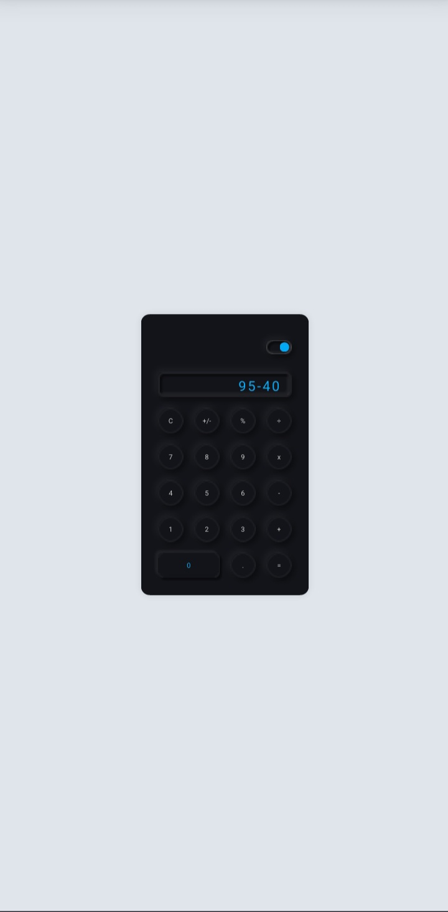

<h1 align="center"> Neumorphic Calculator - Dark and Light Themes </h1>

  

 

## 💻 Projeto

O projeto é uma calculadora simples com temas 'Dark' e 'Light'. Durante o desenvolvimento do projeto, aprendi como reutilizar variáveis do CSS e trabalhar com template areas, colunas e formatação de caracteres com javascript.
- [Veja o Projeto na web aqui](https://iarley-01.github.io/neumorphic-web-calculator/)

## 🚀 Tecnologias

O projeto foi desenvolvido com as linguagens: 

- HTML e CSS
- JavaScript